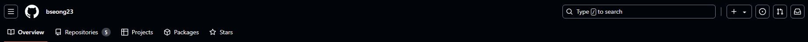

# GIT이란?

- 분산버전관리 시스템
- 왜 사용할까?
   - 저장하는데 데이터 용량을 줄일 수 있다.
   - 버그나 이전 상황으로 돌아가야 할 경우 사용할 수 있다.
 - git의 영역
    - git의 영역은 3개로 나뉜다.
    - 첫 번째 Working Directory
     실제 작업 중인 파일들이 위치하는 영역
    - 두 번째 Staging Area 
     working directory에서 변경된 파일 중, 다음 버전에 포함시킬 파일들을 선택적으로 추가하거나 제외할 수 있는 중간 준비 영역이다.
    - 세 번째 Repository
     버전(commit) 이력과 파일들이 영구적으로 저장되는 영역, 모든 버전과 변경 이력이 기록된다.

## git사용방법
  - git을 사용하기 앞서 먼저 설정해야 할 일이 있다.
    그건 바로 `git config --global user.email "UserEmail"`과 `git config --global user.name "UserName"`이다. 이 명령어는 유저의 이름과 이메일을 등록하는 명령어로 commit을 하기 전까지 반드시 해주어야 하는 작업이다. 그렇지 않으면 commit자체가 불가능하다...
  - 유저네임과 유저이메일을 등록했다면, 먼저 git저장소를 생성할 필요가 있다. 명령어는 `git init`으로 가능하다. 이렇게 하게 된다면 .git이라는 숨김폴더가 만들어지게 된다. 이제부터 git을 활용해 버전관리가 가능해지게 된다!!
  - 그래서 저장소는 만들었는데 결국 어떻게 gitHub이란 곳에 넣을 수 있는거야? 라는 궁금증이 생긴다. 사실 gitHub에 remote하는 것이 우선 순위는 아니다. 먼저 위에서 설명한 것 처럼 Staging Area와 Repository 영역에 버전을 기록해야만 gitHub에 push가 가능하다.
  - 그 순서는 `git add "원하는 파일명"` 또는 `git add . `을 먼저 사용하게 된다. add를 사용하게 되면 staging 영역으로 보낼 수 있다. 여기서 보내는 것은 파일을 보내는 것이 아닌 변경된 사항들을 기록해서 보내는 것이다. 
  - 그 다음 순서로는 `git commit -m "commit이름"`으로 넘어가게 된다. 이 명령어를 사용하게 되면 드디어 gitReposistory에 커밋이 남게 된다. 그럼 commit을 하면 gitHub으로 넘어가게 될까? 아쉽게도 그렇지 않다.
  - 그렇다면 이제 궁극적으로 우리가 사용하는 gitHub에 어떻게 기록들을 보낼 수 있을까? 그러기 위해서는 먼저 gitHub에서 reposistory를 만들 필요가 있다. 만드는 방법은 
  여기서 +를 눌러서 New repository를 누르게 된다면 새로운 repository를 생성 할 수 있다. 그렇게 만든 새로운 repository의 url을 가져오게 된다면 드디어 내가 만든 버전들과 gitHub을 연결할 수 있는 상태가 된다.
  - 가져온 url은 `git remote add origin "URL"`을 사용하게 되면 우리의 git저장소와 연결이 된다. 이제 우린 `git push origin master`을 사용해서 gitHub에 우리의 커밋들을 올릴 수 있다. 
  - pull과 clone
    - 우린 이제 push를 통해 gitHub에 커밋들을 올릴 수 있게 되었다. 그렇다면 올라가 있는 commit들을 어떻게 가져와서 사용할 수 있을까? 그 방법으로 pull과 clone이 있다. 먼저 clone은 말 그대로 복제하는 것이다. 보통 프로젝트를 **처음** 시작할 때 clone을 받아와서 작업을 시작하게 된다. 그럼 그 이후엔 어떻게 변경된 파일들을 받아오지? 그럴 때 바로 필요한 것이 pull이다. pull은 gitHub에 올라간 commit을 받아오는 역할을 한다. 
## README.md
   - README.md는 마크다운 언어이다. 지금 이렇게 작성하고 기록하고 있는 것이 바로 마크다운이다. repository를 사용하게 되면 가장 먼저 눈에 보이는 것이 README.md파일이므로 우리는 이것을 통해서 프로젝트를 잘 설명하고 기록해 둘 필요가 있다. 

## 활용방법
   - repository는 하나밖에 연결하지 못할까? 아니다. 여러개를 연결 할 수 있다. 그러기 위해선 `git remote add origin "URL"`에서 origin부분의 이름을 바꿔서 연결해 주면 된다. 그럼 여기서 우린 origin이란 것이 이름을 뜻한다는 것을 알 수 있다. 즉 굳이 origin이 아니여도 상관이 없다는 말인데 개발자들은 관습적으로 origin을 사용하고 있다. (특별한 상황이 아니면 항상 관습적으로 하는 것을 따라가는 것이 좋다.)
   - 우리는 이것을 활용해 작업환경이 다른 경우에도 하던 작업을 이어서 할 수 있다. clone을 받아와서 push를 통해서 데스크탑에서 작업을 했다면 노트북에서 pull을 받아와서 데스크탑에서 했던 작업을 이어서 할 수 있다. 
   - 사실 git은 협업을 할 때 가장 빛이난다. 하지만 협업에서 git을 사용하게 된다면 혼자 작업할 때와 다르게 많은 시련이 올 것이다. 그럴 때 사용하는 더욱 더 심화 git은 아직 배우지 않았다. 
  
## 느낀점
   - 이번 시간 git을 배우면서 무작정 사용하기만 했던 지난 날들이 떠올랐다. 명령어만 쓸 줄 알면되지 라는 생각으로 사용해왔는데 그러기에 프로젝트를 하면 항상 어려움을 겪어왔던 것 같다. 이번 기회는 기초부터 배울 수 있는 좋은 기회가 되었다. 빨리 git심화버전을 배우고 싶다는 생각이 들었다. 