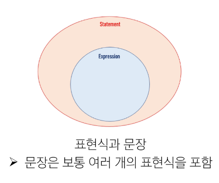
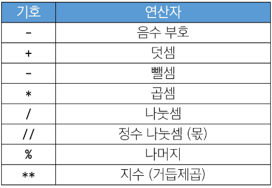
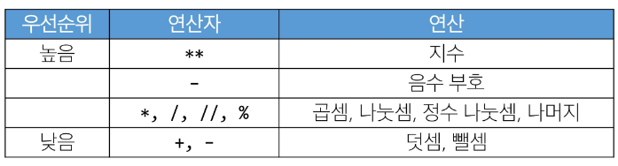

# Python 기본문법(1)

## 프로그램
프로그램이란? 명령어들의 집합이다. 프로그래밍의 핵심은 새 연산을 정의하고 조합해 유용한 작업을 수행하는 것이다. 즉, 프로그래밍은 문제를 해결하는 매우 강력한 방법이다.

### 프로그래밍 언어
컴퓨터에게 작업을 지시하고 문제를 해결하는 도구이다.

## 파이썬
1) 파이썬을 왜 배울까?
   - 쉽고 간결한 문법, 읽기 쉽고 쓰기 쉬운 문법을 가지고 있어 쉽게 배우고 활용할 수 있음
   - 파이썬 커뮤니티의 지원, 세계적인 규모의 풍부한 온라인 포럼 및 커뮤니티 생태계
   - 광범위한 응용 분야, 웹 개발, 데이터 분석, 인공지능, 자동화 스크립트 등 다양한 분야에서 사용
2) 알고리즘 구현에 유리한 python
    - 직관적인 문법, 복잡한 논리 구조의 알고리즘을 이해하고 구현하기에 쉬움
    - 강력한 표준 라이브러리, 다양한 알고리즘 구현에 필요한 도구를 제공
    - 빠른 프로토타이핑, 알고리즘을 빠르게 테스트하고 수정할 수 있음
3) 파이썬 프로그램이 실행되는 과정 
    - 컴퓨터는 기계어로 소통하기 때문에 사람이 기계어를 직접 작성하기는 어려움
    - 인터프리터(언어를 번역하는 역할)가 사용자의 명령어를 운영체제가 이해하는 언어로 바꿈
4) 파이썬 인터프리터를 사용하는 2가지 방법
   - shell이라는 프로그램으로 한 번에 한 명령어씩 입력해서 실행한다.
   - 확장자가 .py인 파일에 작성된 파이썬 프로그램을 실행한다.

### 표현식
- 정의 : 값으로 평가될 수 있는 코드 조각
- 값? 표현식이 평가된 결과를 말한다.
  ex) 3 + 5 = 8 에서 3 + 5는 표현식, 8은 값이다. 즉, 표현식이 평가되어 값이 반환되었음을 알 수 있다.

- 평가 : 표현식을 실행하여 값을 얻는 과정, 표현식을 순차적으로 평가하여 프로그램의 동작을 결정한다.
- 문장 : 실행 가능한 동작을 기술하는 코드(조건문, 반복문, 함수 정의 등)
 

### 타입
- 정의 : 변수나 값이 가질 수 있는 데이터의 종류를 의미, 어떤 종류의 데이터인지, 어떻게 해석되고 처리되어야 하는지를 정의한다. 타입은 2가지 요소로 이루어짐 "값"과 "값에 적용할 수 있는 연산"
- 데이터 타입
 
1. Numeric Type
 
2. Sequence Type
 
3. Text Sequence Type
 
4. Non-Sequence Types
 
5. 기타 (Boolean, None, Functions)
- 타입의 중요성 : 데이터 타입에 맞는 연산을 수행할 수 있기 때문에 중요하다.
- 산술 연산자
 

- 연산자 우선순위

 

### 변수
- 정의 : 값을 저장하기 위한 이름 -> 값을 참조하기 위한 이름
- 변수 할당 : 표현식을 통해 변수에 값을 저장
- 할당문
1. 할당 연산자(=) 오른쪽에 있는 표현식을 평가해서 값(메모리 주소)을 생성
2. 값의 메모리 주소를 '='왼쪽에 있는 변수에 저장한다.
    - 존재하지 않는 변수라면 새 변수를 생성
    - 기존에 존재했던 변수라면 기존 변수를 재사용해서 변수에 들어 있는 메모리 주소를 변경
- 변수명 규칙
1. 영문 알파벳, 언더스코어(_), 숫자로 구성
2. 숫자로 시작할 수 없음
3. 대소문자를 구분
4. 파이썬에서 내부 예약어로 설정된 키워드

## 데이터 타입
- 데이터 타입은 값의 종류와 그 값에 적용 가능한 연산과 동작을 결정하는 속성을 말한다.
- 데이터 타입이 왜 필요할까?
    - 값들을 구분하고, 어떻게 다뤄야 하는지를 알 수 있음
    - 요리 재료마다 특정한 도구가 필요하듯이 각 데이터 타입 값들도 각자에게 적합한 도구를 가진다
    - 타입을 명시적으로 지정하면 코드를 읽는 사람이 변수의 의도를 더 쉽게 이해할 수 있고, 잘못된 데이터 타입으로 인한 오류를 미리 예방할 수 있다

## Numeric Types
- int : 정수 자료형
- float : 실수 자료형 -> 프로그래밍 언어에서 float는 실수에 대한 근삿값

## Sequence Types
- 여러 개의 값들을 순서대로 나열하여 저장하는 자료형(str, list, tuple, range)
- Sequencce Types 특징
    - 순서(Sequence) : 값들이 순서대로 저장(정렬x)
    - 인덱싱(indexing) : 각 값에 고유한 인덱스(번호)를 가지고 있으며, 인덱스를 사용하여 특정 위치의 값을 선택하거나 수정할 수 있음
    - 슬라이싱(Slicing) : 인덱스 범위를 조절해 부분적인 값을 추출할 수 있음
    - 길이(Length) : len() 함수를 사용하여 지정된 값의 개수(길이)를 구할 수 있음
    - 반복(Iteration) : 반복문을 사용하여 지정된 값들을 반복적으로 처리할 수 있음
- str : 문자열(문자들의 순서가 있는 변경 불가능한 시퀀스 자료형)
- 중첩따옴표
    - 작은따옴표가 들어 있는 경우는 큰따옴표로 문자열 생성(반대의 경우엔 반대로)
    - '\' 역슬래쉬 뒤에 특정 문자가 와서 특수한 기능을 하는 문자 조합(파이썬의 일반적인 문자열 규칙을 잠시 탈출한다)
- String Interpolation
    - 문자열 내에 변수나 표현식을 삽입하는 방식
    - 문자열에 f 또는 F 접두어를 붙이고 표현식을 {expression}로 작성하는 문법
    - 문자열에 파이썬 표현식의 값을 삽입할 수 있음
 

.png)

- 인덱스(Index)
    - 시퀀스 내의 값들에 대한 고유한 번호로, 각 값의 위치를 식별하는 데 사용되는 숫자, 파이썬은 음수 index를 제공한다.(주의사항 -1이 제일 끝 값이다.)
- 슬라이싱(Slicing)
    - 시퀀스의 일부분을 선택하여 추출하는 작업, 시작 인덱스와 끝 인덱스를 지정하여 해당범위의 값을 포함하는 새로운 시퀀스를 생성
    - ex) my_str = ‘hello’ my_str[2:4] → 2이상 4미만 즉 ‘ll’이 나온다
     my_str[:3] → 처음부터 3미만까지
     my_syr[3:] → 3부터 끝까지
     my_str[0:5:3] → 0부터 5미만까지 2칸 가격으로 자르겠다.
     my_str[::-1] → 뒤에서부터 처음까지(문자열을 뒤집을 수 있다.)
    - 불변인 이유는 무엇일까? 메모리 주소값을 가르키고 있기 때문에 데이터를 바꿀 수 없다. 바꾸고 싶으면 재할당을 통해서 바꿔야한다.