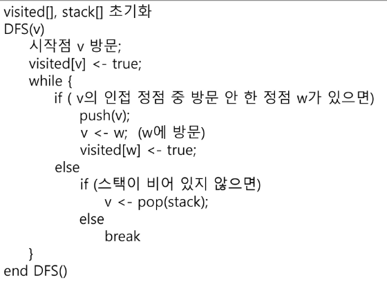

### Memoization

- 메모이제이션은 컴퓨터 프로그램을 실행할 때 이전에 계산한 값을 메모리에 저장해서 다시 계산하지 않도록 하여 전체적인 실행속도를 빠르게 하는 기술이다. 동적 계획법의 핵심이 되는 기술이다
- 메모리제이션 (x) 메모이제이션(o)

```python
# 메모이제이션을 활용한 피보나치수열
# memo를 위한 배열을 할당하고, 모두 0으로 초기화 한다.
# memo[0]을 0으로 memo[1]는 1로 초기화 한다.

def fibo1(n):
	global memo
	if n >= 2 and memo[n] == 0:
		memo[n] == fibo1(n-1) + fibo1(n-2)
	return memo[n]

memo = [0] * (n+1)
memo[0] = 0
memo[1] = 1
```

### DP

- 동적 계획(Dynamic Programming) 알고리즘은 그리디 알고리즘과 같이 **최적화 문제**를 해결하는 알고리즘이다.
- 동적 계획 알고리즘은 먼저 입력 크기가 작은 부분 문제들을 모두 해결한 후에 그 해들을 이용하여 보다 큰 크기의 부분 문제들을 해결하여, 최종적으로 원래 주어진 입력의 문제를 해결하는 알고리즘이다.
- 피보나치 수 DP적용
    - 피보나치 수는 부분 문제의 답으로부터 본 문제의 답을 얻을 수 있으므로 최적 부분 구조로 이루어져 있다.

```python
# 피보나치 수 DP적용 알고리즘

def fibo2(n):
	f = [0] * (n+1)
	f[0] = 0
	f[1] = 1
	for i in range(1, n+1):
		f[i] = f[i-1] + f[i-2]
		
	return f[n]
```

### DFS(깊이우선탐색)

- 비선형구조인 그래프 구조는 그래프로 표현된 모든 자료를 빠짐없이 검색하는 것이 중요함.
- 두 가지 방법
    - 깊이 우선 탐색(Depth First Search, DFS)
    - 너비 우선 탐색(Breadth First Search, BFS)
- 시장 정점의 한 방향으로 갈 수 있는 경로가 있는 곳까지 깊이 탐색해 가다가 더 이상 갈 곳이 없게 되면, 가장 마지막에 만났던 갈림길 간선이 있는 정점으로 되돌아와서 다른 방향의 정점으로 탐색을 계속 반복하여 결국 모든 정점을 방문하는 순회방법
- 가장 마지막에 만났던 갈림길의 정점으로 되돌아가서 다시 깊이 우선 탐색을 반복해야 하므로 후입선출 구조의 스택 사용

