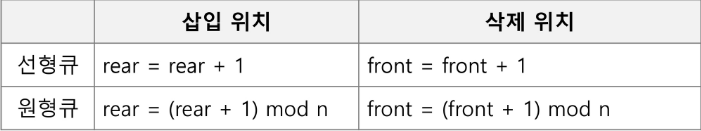

### 큐의 특성

- 스택과 마찬가지로 삽입과 삭제의 위치가 제한적인 자료구조
    - 큐의 뒤에서는 삽입만 하고, 큐의 앞에서는 삭제만 이루어지는 구조
- 선입선출구조(FIFO : Fist In First Out)
    - 큐에 삽입한 순서대로 원소가 저장되어, 가장 먼저 삽입된 원소는 가장 먼저 삭제된다.

### 선형큐

- 1차원 배열을 이용한 큐
    - 큐의 크기 = 배열의 크기
    - front : 저장된 첫 번째 원소의 인덱스
    - rear : 저장된 마지막 원소의 인덱스
- 상태표현
    - 초기 상태 : front = rear = -1
    - 공백 상태 : front == rear
    - 포화 상태 : rear == n-1(n = 배열의 크기)
- 초기 공백 큐 생성
    - 크기 n 인 1차원 배열 생성
    - front, rear -1로 생성
- 삽입: euQueue(item)
    - 마지막 원소 뒤에 새로운 원소를 삽입하기 위해
        1. rear 값을 하나 증가시켜 새로운 원소를 삽입할 자리를 마련
        2. 그 인덱스에 해당하는 배열원소 Q[rear]에 item을 저장
- 삭제 : deQueue()
    - 가장 앞에 있는 원소를 삭제하기 위해
        1. front 값을 하나 증가시켜 큐에 남아있는 첫 번째 원소 이동
        2. 새로운 첫 번째 원소를 리턴 함으로써 삭제와 동일한 기능함
- 공백상태 및 포화상태 검사 : isEmpty(), isFull()
    - 공백상태 : front == rear
    - 포화상태 : rear == n-1
- 검색 : Qpeek()
    - 가장 앞에 있는 원소를 검색하여 반환하는 연산
    - 현재 front의 한자리 뒤(front+1)에 있는 원소, 즉 큐의 첫 번째에 있는 원소를 반환

### 선형큐의 문제점

- 선형 큐를 이용하여 원소의 삽입과 삭제를 계속할 경우, 배열의 앞부분에 활용할 수 있는 공간이 있음에도 불구하고, rear = n-1인 상태 즉, 포화상태로 인식하여 더 이상 삽입을 수행하지 않게 됨
- 해결방법 1
    - 매 연산이 이루어질 때마다 저장된 원소들을 배열의 앞부분으로 모두 이동시킨다.
    - 그러나 원소 이동에 많은 시간이 소요되어 큐의 효율성이 급격히 떨어짐
- 해결방법 2
    - 1차원 배열을 사용하되, 논리적으로는 배열의 처음과 끝이 연결되어 원형형태의 큐를 이룬다고 가정하고 사용
    

### 원형 큐의 구조

- 초기 공백 상태
    - front = rear = 0
- Index 순환
    - front와 rear의 위치가 배열의 마지막 인덱스인 n-1를 가르킨 후, 그 다음에는 논리적 순환을 이루어 배열의 처음 인덱스인 0으로 이동해야함
    - 이를 위해 나머지 연산자 mod를 사용함
- front 변수
    - 공백 상태와 포화 상태로 구분을 쉽게 하기 위해 front가 있는 자리는 사용하지 않고 항상 빈자리로 둠
- 삽입 위치 및 삭제 위치




### 연결 큐
  - 단순 연결 리스트(Linked List)를 이용한 큐
    - 큐의 원소 : 단순 연결 리스트의 노드
    - 큐의 원소 순서 : 노드의 연결 순서, 링크로 연결되어 있음
    - front : 첫 번째 노드를 가리키는 링크
    - rear : 마지막 노드를 가리키는 링크

### 덱_deque
- 컨테이너 자료형 중 하나
- deque 객체
  - 양쪽 끝에서 빠르게 추가와 삭제를 할 수 있는 리스트류 컨테이너

- 연산
  - append(x) : 오른쪽에 x 추가
  - popleft() : 왼쪽에서 요소를 제거하고 반환. 요소가 없으면 IndexEror

  ```py
  from collections import deque

  q = deque()
  q.append(1)   # enqueue()
  t = q.popleft() # dequeue()
  ```

### 우선순위 큐(Priority Queue)
- 우선순위 큐의 특성
  - 우선순위를 가진 항목들을 저장하는 큐
  - FIFO 순서가 아니라 우선순위가 높은 순서대로 먼저 나가게 된다.

- 우선순위 큐의 적용 분야
  - 시뮬레이션 시스템
  - 네트워크 트래픽 제어
  - 운영체제의 테스크 스케일링

- 배열을 이용하여 우선순위 큐 구현
  - 배열을 이용하여 자료 저장
  - 원소를 삽입하는 과정에서 우선순위를 비교하여 적절한 위치에 삽입하는 구조
  - 가장 앞에 최고 우선순위의 원소가 위치하게 됨

- 문제점
  - 배열을 사용하므로, 삽입이나 삭제 연산이 일어날 때 원소의 재배치가 발생함
  - 이에 소요되는 시간이나 메모리 낭비가 큼

## 버퍼(Buffer)
- 버퍼
  - 데이터를 한 곳에서 다른 한 곳으로 전송하는 동안 일시적으로 그 데이터를 보관하는 메모리의 영역
  - 버퍼링 : 버퍼를 활용하는 방식 또는 버퍼를 채우는 동작을 의미한다.

- 버퍼의 자료 구조
  - 버퍼는 일반적으로 입출력 및 네트워크와 관련된 기능에서 이용된다.
  - 순서대로 입력/출력/전달 되어야 하므로 FIFO 방식의 자료구조인 큐가 활용된다.
